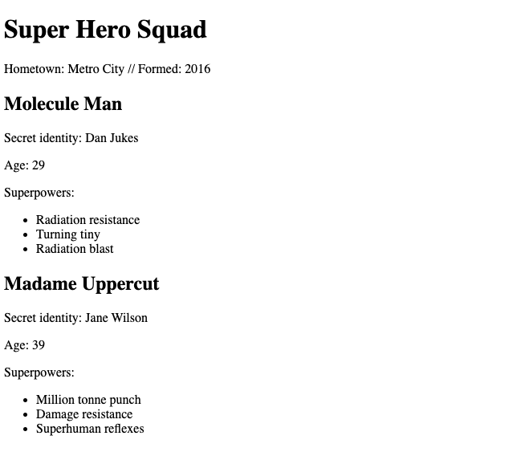

# JSON-ASYNC-APIS (Super Heroes and Random GIF Generator)
> A repository dedicated to JSON, Asynchronous Programming and APIS using Javascript.

## Built With

- Javascript
- HTML
- Terminal
- Fetch API

## Getting Started

**The project is designed to test my capalities of using json, practising asynchronous programming and using API's**

- **Understanding the files and Content**
 - index.html : Loads content for super hero data in simple HTML format
 - index.js : Contains a process of accessing the data and rendering it to the index.html page
 - index-api.html : Loads content for data fetched from GIPHY in simple HTML format
 - index-api.js : Contains a process of accessing the data from GIPHY and rendering it to the index.html page

- **Execution**
  - Clone this repository to your local machine
  - Open index.html or index-api.html in your browser for results.

## Author 

👤 **Elbie Moonga**

- GitHub: [@Elbie-Em](https://github.com/Elbie-em)
- Twitter: [ElbieEm](https://twitter.com/ElbieEm)
- LinkedIn: [elbie-moonga](https://www.linkedin.com/in/elbiemoonga/)

## 🤝 Contributing

Contributions and issues are welcome!

## Show your support

Give me a ⭐️ if you like this project!

## Acknowledgments

- [Microverse](microverse.org)
- [The Odin Project](https://www.theodinproject.com/courses/javascript/lessons/working-with-apis?ref=lnav)
- [GIHPY](https://developers.giphy.com/)

